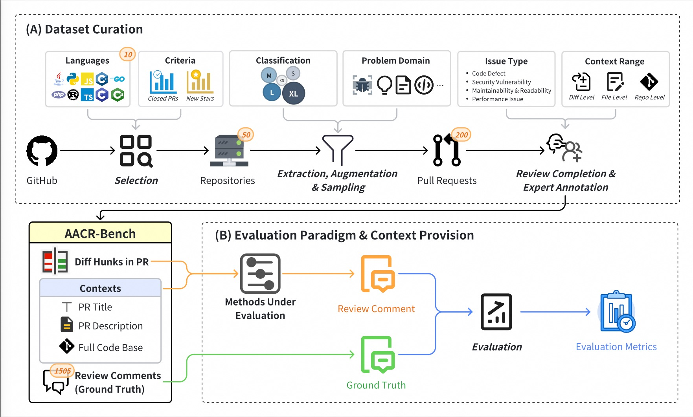
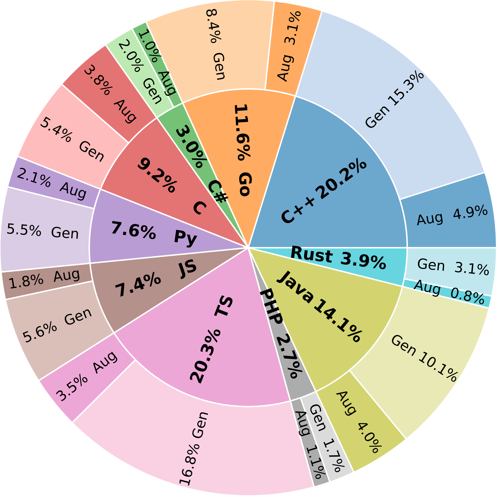
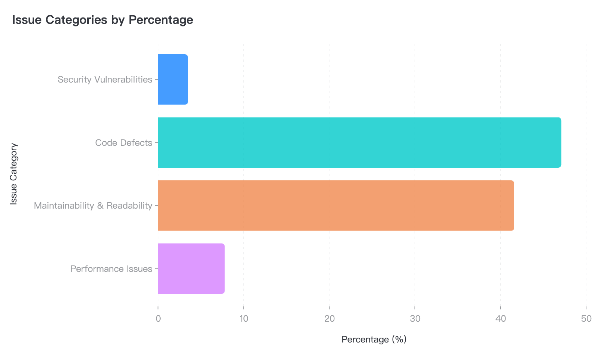
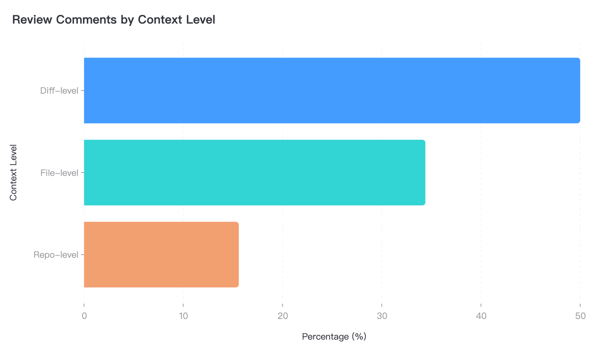

[//]: # (# AACR-Bench: Multi-lingual, Repository-level Context-aware Automated Code Review Benchmark)


<div align="center">

[](LICENSE)
[](https://arxiv.org/abs/2601.19494)


English | [简体中文](README.zh-CN.md)

</div>

## 📋 Introduction
AACR-Bench is the **industry's first multilingual, repository-level context-aware code review evaluation dataset**, designed to assess the performance of large language models in automated code review tasks. The dataset comprises 200 real Pull Requests from 50 active open-source projects, covering 10 mainstream programming languages. Each instance includes not only code changes but also preserves complete repository context, authentically reproducing the entire code review process. Through human-LLM collaborative review combined with multi-round expert annotation, we ensure high quality and comprehensiveness of the data.


## ✨ Core Features

### 🌍 **Multi-language Coverage**
Covers **10** mainstream programming languages used in projects:
- **System-level languages**: C++, Rust, Go
- **Enterprise languages**: Java, C#, TypeScript
- **Scripting languages**: Python, JavaScript, Ruby, PHP

### 📁 **Repository-level Context**
- Preserves complete project structure
- Supports cross-file references and inter-module interaction analysis
- Includes PR metadata (description, title, comments, etc.)

### 🤖 **Human Expert + LLM Enhanced Annotation**

####  **Professional Annotation Team**
-  **80+** senior software engineers with **2+ years** of experience
-  Covers **frontend**, **backend**, **architecture**, and other domains
-  **Three rounds** of cross-validation

####  **LLM Intelligent Enhancement**  
-  **Systematic** issue discovery
-  **Comprehensive** defect identification
-  **Improvement** suggestion generation

**Quality Assurance Process**: GitHub human comments → LLM enhancement → Expert multi-round cross-annotation → Consistency validation

## 🎯 Evaluation Capabilities and Applications

AACR-Bench provides systematic evaluation capabilities across **four core dimensions**, supporting diverse research and application scenarios:

### Evaluation Dimension System

| 1️⃣ **Multi-language Evaluation** (10 Languages) | 2️⃣ **Positioning Accuracy Evaluation** (Line-level) |
|:---|:---|
| • **Cross-language performance comparison**: Identify model strengths and weaknesses across languages<br>• **Language-specific optimization**: Improve model capabilities for specific languages<br>• **Generalization assessment**: Test model's language transfer effectiveness | • **Precise positioning**: Assess single-line/multi-line issue location accuracy<br>• **Cross-file tracking**: Test cross-file reference identification capability<br>• **Context boundaries**: Verify issue scope judgment accuracy |
| **3️⃣ Issue Classification Evaluation (4 Categories)** | **4️⃣ Context Understanding Evaluation (3 Levels)** |
| • **Classification accuracy**: Assess issue type identification capability<br>• **Severity assessment**: Test issue priority judgment<br>• **Specialized capabilities**: Analyze detection rates for specific issue types | • **Diff-level understanding**: Basic code change analysis<br>• **File-level understanding**: Complete file logic comprehension<br>• **Repo-level understanding**: Project-wide dependency analysis |
### Typical Application Scenarios

####  **Model Development**
- **Performance benchmarking**: Evaluate new models' code review capabilities using unified standards
- **Weakness analysis**: Discover model shortcomings through fine-grained metrics (e.g., low recall in certain languages)
- **Iterative optimization validation**: Quantify improvement effects, guide continuous model optimization

####  **Academic Research**
- **Comparative studies**: Fair comparison of different model architectures/training methods
- **Ablation experiments**: Analyze the impact of different context levels on review quality
- **New method validation**: Provide standardized evaluation environment for innovative algorithms

####  **Engineering Practice**
- **Model selection**: Help teams choose review models suitable for project characteristics
- **Pre-deployment validation**: Ensure model reliability in production environments
- **Continuous monitoring**: Track model performance changes in actual use

## 🚀 Quick Start (TBD)
### Install Dependencies
```bash

```

### Download Dataset
```bash

```

### Run Evaluation
```python

```

## 📈 Data Overview
### Dataset Scale
<div>
<table>
<tr>
<td align="center" width="25%">
<h3>200</h3>
<b>Pull Requests</b>
</td>
<td align="center" width="25%">
<h3>10</h3>
<b>Programming Languages</b>
</td>
<td align="center" width="25%">
<h3>50</h3>
<b>Source Projects</b>
</td>
<td align="center" width="25%">
<h3>2,145</h3>
<b>Review Comments</b>
</td>
</tr>
</table>
</div>

### Classification Statistics
##### Language Distribution




### Data Format
```json
{
  "type": "array",
  "item": {
    "change_line_count": {"type": "integer", "description": "Number of changed lines"},
    "project_main_language": {"type": "string", "description": "Project main language"},
    "source_commit": {"type": "string", "description": "Source commit"},
    "target_commit": {"type": "string", "description": "Target commit"},
    "githubPrUrl": {"type": "string", "description": "GitHub PR URL"},
    "comments": {
      "is_ai_comment": {"type": "boolean", "description": "Whether it's an AI comment"},
      "note": {"type": "string", "description": "Comment content"},
      "path": {"type": "string", "description": "File path"},
      "side": {"type": "string", "description": "Comment anchor position"},
      "source_model": {"type": "string", "description": "Source model"},
      "from_line": {"type": "integer", "description": "Start line number"},
      "to_line": {"type": "integer", "description": "End line number"},
      "category": {"type": "string", "description": "Issue category: Security/Defect/Maintainability/Performance"},
      "context": {"type": "string", "description": "Comment scope: diff/file/repo level"}
    }
  }
}
```

## 📏 Evaluation Metrics
We employ a multidimensional metric system to comprehensively evaluate code review model performance. For complete metric definitions, calculation methods, and language-specific statistics, please refer to [metrics.md](docs/metrics.md).

### Core Metrics
| Metric             | Description                                 | Formula                               |
|--------------------|---------------------------------------------|---------------------------------------|
| **Precision**      | Proportion of valid comments generated      | `Valid matches / Total generated`     |
| **Recall**         | Ability to discover annotated issues        | `Valid matches / Dataset valid count` |
| **Line Precision** | Ability to precisely locate code lines      | `Line matches / Total generated`      |
| **Noise Rate**     | Proportion of invalid or incorrect comments | `Unmatched / Total generated`         |

## 🤝 Contributing
We welcome community contributions! If you want to contribute to AACR-Bench, please follow these steps:

1. **Fork** this repository
2. **Create** feature branch (`git checkout -b feat/add-new-prs`)
3. **Commit** changes (`git commit -m 'feat: add new PRs'`)
4. **Push** to branch (`git push origin feat/add-new-prs`)
5. **Create** Pull Request

For detailed contribution guidelines, please refer to [CONTRIBUTING.md](CONTRIBUTING.md)

## 👥 Authors and Maintainers
| Name           | GitHub                                             | Domain               | Responsibilities                                                  |
|----------------|----------------------------------------------------|----------------------|-------------------------------------------------------------------|
| Zhengfeng Li   | [@lizhengfeng](https://github.com/lizhengfeng101)  | Project Lead         | Overall architecture design, technical direction                  |
| Boge Wang      | [@wangboge](https://github.com/wbgbg)              | Technical Consultant | Technical Solution Review, technical Guidance                     |
| Lei Zhang      | [@zhanglei](https://github.com/TongWu-ZL)          | Data Architecture    | Evaluation framework, metric system, performance optimization     |
| Yongda Yu      | [@yuyongda](https://github.com/inkeast)            | Evaluation System    | Data schema design, evaluation protocol, quality standards        |
| Xinxin Guo     | [@guoxinxin](https://github.com/guoxinxin125)      | Annotation Platform  | Annotation system development, workflow design, quality assurance |
| Minghui Yu     | [@yuminghui](https://github.com/yuminghui)         | AI Enhancement       | LLM annotation pipeline, model selection, prompt optimization     |
| Zhengqi Zhuang | [@zhuangzhengqi](https://github.com/ZhengqiZhuang) | Engineering          | CI/CD pipeline, automated testing, deployment scripts             |


## 📄 License
This project is licensed under the Apache License 2.0. For details, please see the [LICENSE](LICENSE) file.

## 📚 Citation
If you use AACR-Bench in your research, please cite our paper:
```bibtex
@misc{zhang2026aacrbenchevaluatingautomaticcode,
      title={AACR-Bench: Evaluating Automatic Code Review with Holistic Repository-Level Context}, 
      author={Lei Zhang and Yongda Yu and Minghui Yu and Xinxin Guo and Zhengqi Zhuang and Guoping Rong and Dong Shao and Haifeng Shen and Hongyu Kuang and Zhengfeng Li and Boge Wang and Guoan Zhang and Bangyu Xiang and Xiaobin Xu},
      year={2026},
      eprint={2601.19494},
      archivePrefix={arXiv},
      primaryClass={cs.SE},
      url={https://arxiv.org/abs/2601.19494}, 
}
```

## 🗺️ Roadmap
- [x] v1.0 (2026.01): Initial release - 200 PRs, 10 languages

## 🌟 Acknowledgments
- Thanks to all contributors who participated in data annotation, especially core contributors who completed 15+ valid annotations. Full list in [CONTRIBUTORS.md](CONTRIBUTORS.md).
- Thanks to open-source project maintainers for providing original PR data.