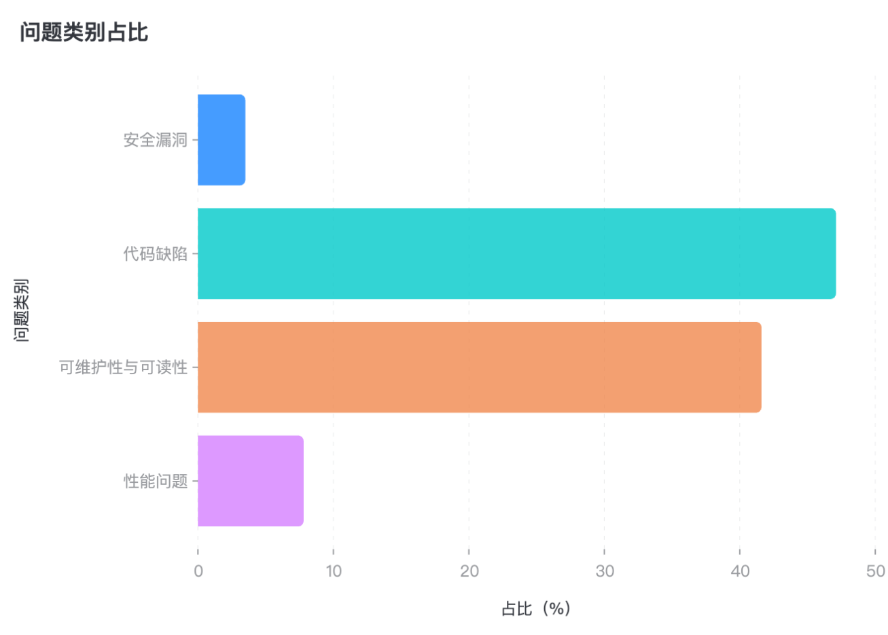
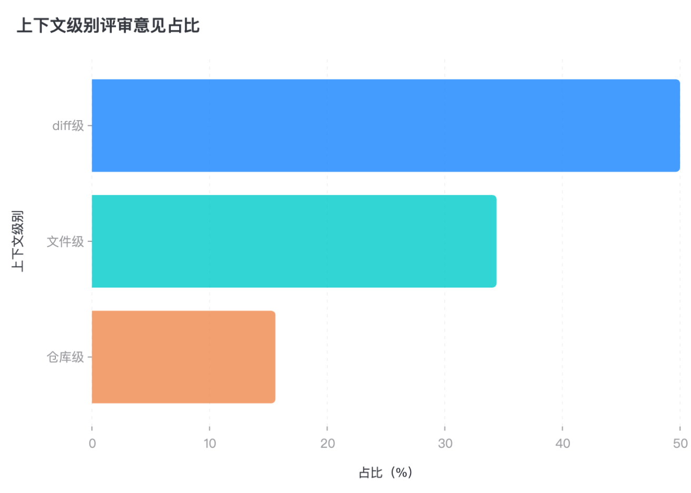

[//]: # (# AACR-Bench: 多语言、仓库级上下文感知的自动化代码评审评测数据集)


<div align="center">

[](LICENSE)
[](https://arxiv.org/abs/2601.19494)


[English](README.md) | 简体中文

</div>

## 📋 简介
AACR-Bench 是**业界首个多语言、仓库级上下文感知的代码评审评测数据集**，可用于评估大语言模型在自动代码评审任务中的表现。数据集包含来自50个活跃开源项目的200个真实Pull Request，覆盖10种主流编程语言，每个实例不仅包含代码变更，还保留了完整的仓库上下文，真实还原了代码评审的全过程。通过人类与LLM协同评审 + 人类专家多轮标注，确保了数据的高质量和全面性。


## ✨ 核心特性
### 🌍 **多语言覆盖**
覆盖 **10种** 主流项目使用的编程语言：
- **系统级语言**：C++, Rust, Go
- **企业级语言**：Java, C#, TypeScript
- **脚本语言**：Python, JavaScript, Ruby, PHP

### 📁 **仓库级上下文**
-  保留完整项目结构
-  支持跨文件引用和模块间交互分析
-  包含PR元数据（描述、标题、评论等）

### 🤖 **人类专家 + LLM增强标注**
#### **专业标注团队**
- **80+**位拥有**2年以上**经验的资深软件工程师
- 覆盖**前端**、**后端**、**架构**等领域
- **三轮**标注交叉验证

#### **LLM 智能增强**
- **系统性**问题发现
- **全面**缺陷识别
- **改进**建议生成

**质量保证流程**：Github人类评论 → LLM增强 → 专家多轮交叉标注 → 一致性检验

## 🎯 评测能力与应用

AACR-Bench 提供**四大维度**的系统化评测能力，支撑多样化的研究与应用场景：

###  评测维度体系

| 1️⃣ **多语言评测** (10种编程语言)                                                               | 2️⃣ **定位精度评测** (行级别)                                                                |
|:--------------------------------------------------------------------------------------|:------------------------------------------------------------------------------------|
| • **跨语言性能对比**：识别模型在不同语言上的强弱项<br>• **语言特定优化**：针对特定语言改进模型能力<br>• **泛化能力评估**：测试模型的语言迁移效果 | • **精确定位能力**：评估单行/多行问题定位准确性<br>• **跨文件追踪**：测试跨文件引用的识别能力<br>• **上下文边界**：验证问题范围判断的准确性 |
| **3️⃣ 问题分类评测 (4大类别)**                                                                 | **4️⃣ 上下文理解评测 (3层级)**                                                               |
| • **分类准确性**：评估问题类型识别能力<br>• **严重度评估**：测试问题优先级判断<br>• **专项能力**：分析特定类型问题的发现率            | • **Diff级理解**：基础代码变更分析<br>• **File级理解**：文件完整逻辑把握<br>• **Repo级理解**：项目全局依赖分析          |

###  典型应用场景

####  **模型研发**
- **性能基准测试**：使用统一标准评估新模型的代码评审能力
- **弱点分析定位**：通过细粒度指标发现模型短板（如：某语言召回率低）
- **迭代优化验证**：量化改进效果，指导模型持续优化

####  **学术研究**
- **对比研究**：公平比较不同模型架构/训练方法的效果
- **消融实验**：分析不同上下文级别对评审质量的影响
- **新方法验证**：为创新算法提供标准化评测环境

####  **工程实践**
- **模型选型**：帮助团队选择适合项目特点的评审模型
- **部署前验证**：确保模型在生产环境的可靠性
- **持续监控**：跟踪模型在实际使用中的性能变化

## 🚀 快速开始（TBD）
### 安装依赖
```bash

```

### 下载数据集
```bash

```

### 运行评测
```python

```


## 📈 数据概览
### 数据集规模
<div>
<table>
<tr>
<td align="center" width="25%">
<h3>200</h3>
<b>Pull Requests</b>
</td>
<td align="center" width="25%">
<h3>10</h3>
<b>编程语言</b>
</td>
<td align="center" width="25%">
<h3>50</h3>
<b>源项目</b>
</td>
<td align="center" width="25%">
<h3>2,145</h3>
<b>评审意见</b>
</td>
</tr>
</table>
</div>

### 分类统计结果
##### 语言类别占比





### 数据格式
```json
{
  "type": "array",
  "item": {
    "change_line_count": {"type": "integer", "description": "修改的行数量"},
    "project_main_language":  {"type": "string", "description": "项目主语言"},
    "source_commit":  {"type": "string", "description": "源commit"},
    "target_commit":  {"type": "string", "description": "目标commit"},
    "githubPrUrl":  {"type": "string", "description": "github 的pr地址"},
    "comments": {
      "is_ai_comment": {"type": "boolean", "description": "是否是AI评论"},
      "note": {"type": "string", "description": "评论内容"},
      "path": {"type": "string", "description": "文件路径"},
      "side": {"type": "string", "description": "评论挂载位置"},
      "source_model": {"type": "string", "description": "来源模型"},
      "from_line": {"type": "integer", "description": "开始行号"},
      "to_line": {"type": "integer", "description": "结束行号"},
      "category": {"type": "string", "description": "问题分类：安全漏洞/代码缺陷/可维护性与可读性/性能问题"},
      "context": {"type": "string", "description": "评论的作用域：diff级/文件级/仓库级"}
    }
  }
}
```

## 📏 评测指标
我们采用多维度指标体系全面评估代码审查模型的性能，完整的指标定义、计算方法和分语言统计请查看 [metrics.md](docs/zh/metrics.md)。

### 核心指标
| 指标                         | 说明          | 计算公式              |
|----------------------------|-------------|-------------------|
| **准确率** (Precision)        | 模型生成的有效评论占比 | `有效匹配数 / 生成总数`    |
| **召回率** (Recall)           | 发现标注集中问题的能力 | `有效匹配数 / 数据集中有效数` |
| **行级准确率** (Line Precision) | 精确定位到代码行的能力 | `行号匹配数 / 生成总数`    |
| **噪声率** (Noise Rate)       | 无效或错误评论的比例  | `未匹配数 / 生成总数`     |


## 🤝 贡献指南
我们欢迎社区贡献！如果您想为 AACR-Bench 做出贡献，请按照以下步骤操作：

1. **Fork** 本仓库
2. **创建** 特性分支 (`git checkout -b feat/add-new-prs`)
3. **提交** 更改 (`git commit -m 'feat: add new PRs'`)
4. **推送** 到分支 (`git push origin feat/add-new-prs`)
5. **创建** Pull Request

详细贡献指南请参考 [CONTRIBUTING.md](CONTRIBUTING.zh-CN.md)

## 👥 作者与维护者
| 姓名      | GitHub                                             | 负责领域  | 主要职责                 |
|:--------|:---------------------------------------------------|:------|:---------------------|
| **李峥峰** | [@lizhengfeng](https://github.com/lizhengfeng101)  | 项目负责人 | 总体架构设计、技术方向把控        |
| **王博格** | [@wangboge](https://github.com/wbgbg)              | 技术顾问  | 技术方案评审、技术指导          |
| **张耒**  | [@zhanglei](https://github.com/TongWu-ZL)          | 数据架构  | 评测框架架构、指标体系设计、性能优化   |
| **于永达** | [@yuyongda](https://github.com/inkeast)            | 评测系统  | 数据模式设计、评测协议制定、质量控制标准 |
| **郭欣欣** | [@guoxinxin](https://github.com/guoxinxin125)      | 标注平台  | 标注系统开发、工作流设计、质量保证机制  |
| **余明晖** | [@yuminghui](https://github.com/yuminghui)         | AI增强  | LLM标注流程、模型选择、提示工程优化  |
| **庄正奇** | [@zhuangzhengqi](https://github.com/ZhengqiZhuang) | 工程化   | CI/CD流程、自动化测试、部署脚本   |


## 📄 许可
本项目采用 Apache License 2.0 许可证，有关详细信息，请参阅 [LICENSE](LICENSE) 文件。

## 📚 引用
如果您在研究中使用了AACR-Bench，请引用我们的论文：
```bibtex
@misc{zhang2026aacrbenchevaluatingautomaticcode,
      title={AACR-Bench: Evaluating Automatic Code Review with Holistic Repository-Level Context}, 
      author={Lei Zhang and Yongda Yu and Minghui Yu and Xinxin Guo and Zhengqi Zhuang and Guoping Rong and Dong Shao and Haifeng Shen and Hongyu Kuang and Zhengfeng Li and Boge Wang and Guoan Zhang and Bangyu Xiang and Xiaobin Xu},
      year={2026},
      eprint={2601.19494},
      archivePrefix={arXiv},
      primaryClass={cs.SE},
      url={https://arxiv.org/abs/2601.19494}, 
}
```

## 🗺️ 路线图
- [x] v1.0 (2026.01): 初始发布 - 200个PR，10种语言

## 🌟 致谢
- 感谢所有参与数据标注的贡献者，特别是完成15条以上有效标注的核心贡献者，完整名单见 [CONTRIBUTORS.md](CONTRIBUTORS.md)。
- 感谢提供原始PR数据的开源项目维护者。