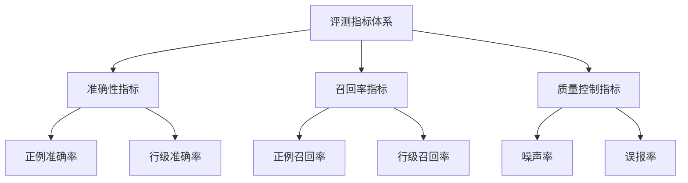

## 指标体系总览
AACR-Bench 采用多层次评测指标体系，从不同维度全面评估代码审查模型的性能。



## 指标定义
### 1. 基础统计量
#### positive_expected_nums（标注有效评论数）
+ 定义：数据集中人工标注的高质量代码审查评论总数
+ 作用：作为召回率计算的分母，衡量数据集的规模

#### total_generated（模型生成评论数）
+ 定义：模型对给定PR生成的所有评论数量
+ 作用：作为准确率计算的分母，反映模型的活跃度
+ 注意：包含有效和无效评论

### 2. 匹配指标
**positive_matches（有效评论匹配数）**：模型生成的评论中，与标注数据语义相符且行号匹配的评论数量

**positive_line_matches（行级匹配数）**：评论定位与正确代码行有交集的评论数量

### 3. 性能指标
#### 准确率指标
**positive_match_rate（正例准确率）**：模型能精确指出问题的能力

```python
positive_match_rate = positive_matches / total_generated
```

**positive_line_match_rate（行级准确率）**：模型能精确定位问题的能力

```python
positive_line_match_rate = positive_line_matches / total_generated
```

#### 召回率指标
positive_recall_rate（正例召回率）：标注问题中有多少被模型发现

```python
positive_recall_rate = positive_matches / positive_expected_nums
```

positive_line_recall_rate（行级召回率）：精确发现并定位问题的比例

```python
positive_line_recall_rate = positive_line_matches / positive_expected_nums
```

#### 噪声控制指标
unmatched_rate（噪声率）：模型产生的无效或错误评论比例

```python
unmatched_rate = unmatched_count / total_generated
```