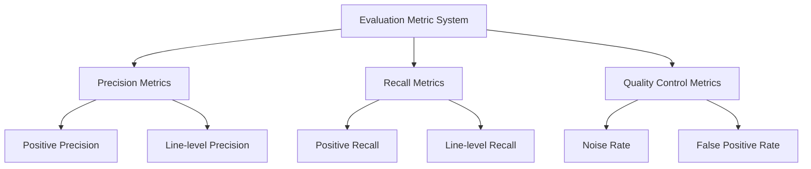

# Evaluation Metrics

## Metrics Overview
AACR-Bench employs a multi-level evaluation metric system to comprehensively assess the performance of code review models from different dimensions.



## Metric Definitions

### 1. Basic Statistics

#### positive_expected_nums (Annotated Valid Comments)
- **Definition**: Total number of high-quality code review comments manually annotated in the dataset
- **Purpose**: Serves as the denominator for recall calculation, measuring the dataset scale

#### total_generated (Model Generated Comments)
- **Definition**: Total number of comments generated by the model for a given PR
- **Purpose**: Serves as the denominator for precision calculation, reflecting model activity
- **Note**: Includes both valid and invalid comments

### 2. Matching Metrics

**positive_matches (Valid Comment Matches)**: Number of model-generated comments that semantically match the annotated data AND have correct line numbers

**positive_line_matches (Line-level Matches)**: Number of comments where the location overlaps with the correct code lines

### 3. Performance Metrics

#### Precision Metrics

**positive_match_rate (Positive Precision)**: Model's ability to accurately identify issues

```python
positive_match_rate = positive_matches / total_generated
```

**positive_line_match_rate (Line-level Precision)**: Model's ability to precisely locate issues

```python
positive_line_match_rate = positive_line_matches / total_generated
```

#### Recall Metrics

**positive_recall_rate (Positive Recall)**: Proportion of annotated issues discovered by the model

```python
positive_recall_rate = positive_matches / positive_expected_nums
```

**positive_line_recall_rate (Line-level Recall)**: Proportion of issues accurately discovered and located

```python
positive_line_recall_rate = positive_line_matches / positive_expected_nums
```

#### Noise Control Metrics

**unmatched_rate (Noise Rate)**: Proportion of invalid or incorrect comments generated by the model

```python
unmatched_rate = unmatched_count / total_generated
```